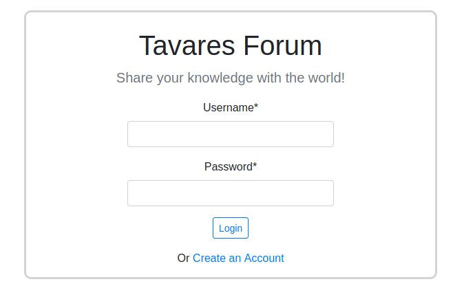
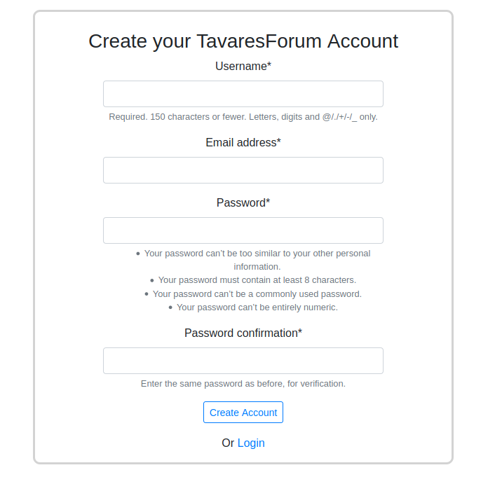
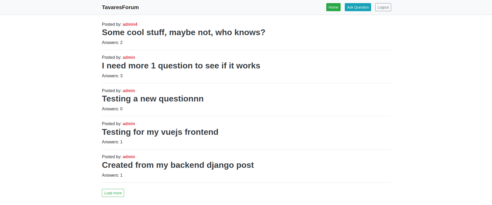
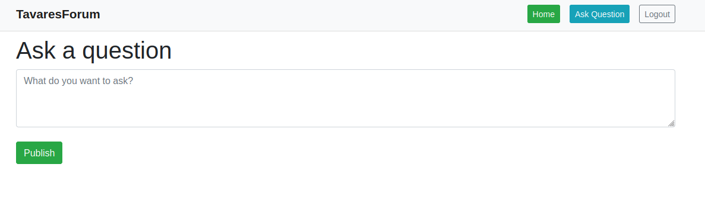
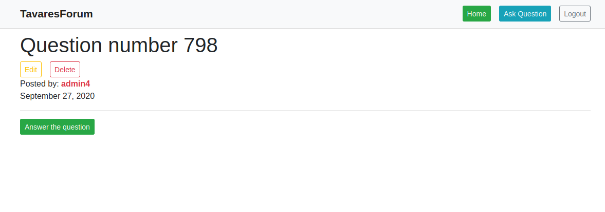
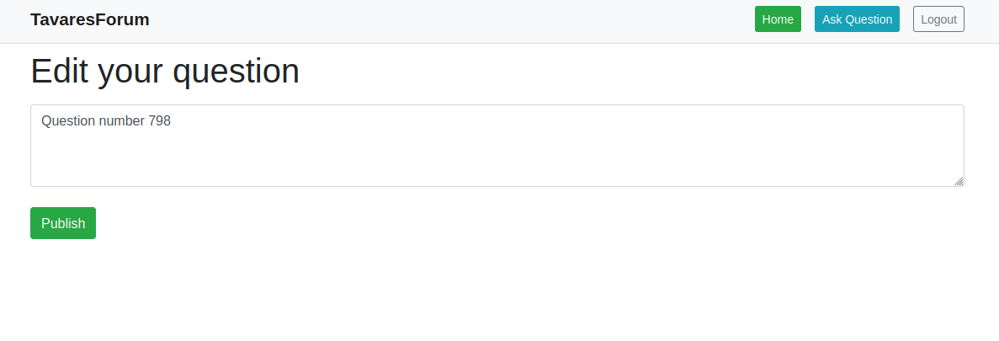
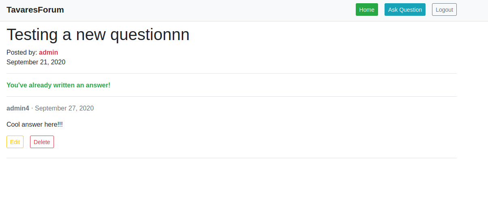
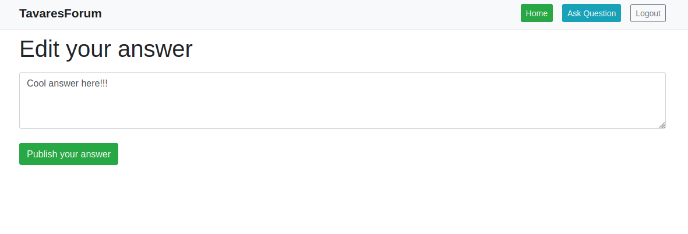
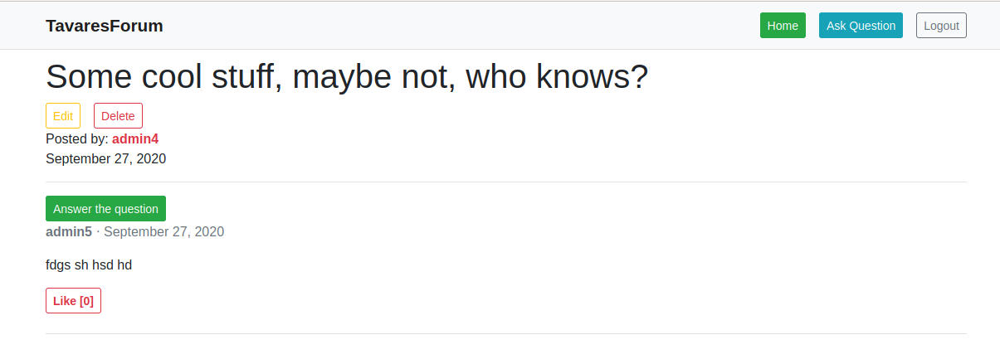
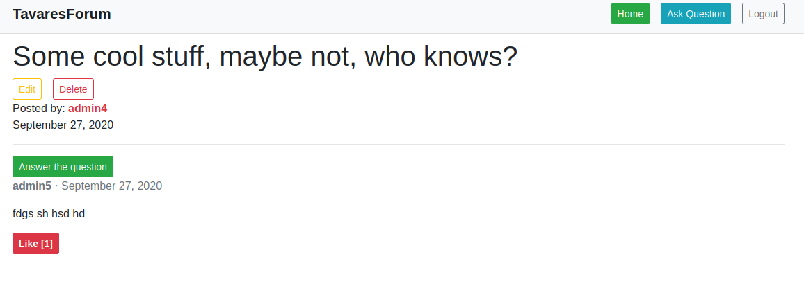

# TavaresForum
TavaresForum is a MVP (minimum value product), of a question. Exploring the basics of Django, Django Rest and Vuejs CLI.
- [Click here](https://tavares-forum.herokuapp.com/) and see the online preview or see some pictures that explain the online preview.
* Features:
  * Login
  * Signup
  * Ask question
  * Edit your question
  * Delete your question
  * Send only 1 answer per question
  * Edit your answer
  * Delete your answer
  * Like others answers
  * Can't like your answer
<br>
<br>
 
<br>
 
<br>
 
<br>
 
<br>
 
<br>
 
<br>
 
<br>
 
<br>
 
<br>
 
<br>

# Backend

## Project setup

### Create a new Virtual Environment
```
pyhton3 -m venv venv
```

### Activate your Virtual Environment
```
source venv/bin/activate
```

### Install dependencies
```
pip install -r requirements.txt
```

### Run server
```
python3 manage.py runserver
```

## Backend notes

### .env
* Create a file .env to set debug and secret-key
```
DEBUG=True
SECRET_KEY=SomeRandomCaracteresWithout''
```

### Login
* Vefiry account email disabled.
  * If wanna enable email vefirycation you can find read this documentation: [django-registration](https://django-registration.readthedocs.io/en/3.1/activation-workflow.html)

### Core directory
* In the core directory you can find:
  * views.py: a file that return a base template from my vue.js app
  * utils.py: method generate_random_string, used within questoes.signals to generate my slug automatically

### Questions app
- The slug from Question model is create automatically from a custom signal (add_slug_to_question)

### Login & Register
* You can use this 2 endpoints to help to test if don't wanna to test with the front web app.
  * http://127.0.0.1:8000/accounts/register/
  * http://127.0.0.1:8000/accounts/login/
  * Or via shell: `python3 manage.py createsuperuser`
  
  
# Frontend

## Project setup
```
npm install
```

### Compiles and hot-reloads for development
```
npm run serve
```

### Compiles and minifies for production
```
npm run build
```

### Lints and fixes files
```
npm run lint
```

## Frontend notes

### Webpack Stats
The first time when you start the frontend, be sure that VUE.JS will create a file called 'webpack-stats.json'.
